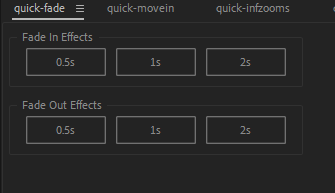
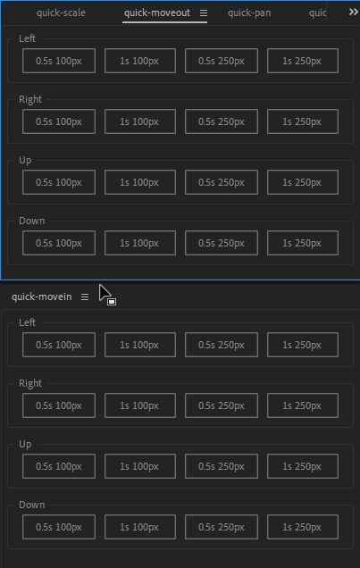

# Adobe After Effects Panel Generator

This repository is a template for [ProJor](https://projor.io), and it can be used to generate _Adobe After Effects Panels_.

Each generated panel is a `.jsx` file, that you can either _run via the [ExtendScript Debugger](https://marketplace.visualstudio.com/items?itemName=Adobe.extendscript-debug)_, or _install_.

You can modify which panels are generated by editing the [`.projor/buttonpanels.pdata.yaml`](.projor/buttonpanels.pdata.yaml) file.

# Showcase

| Panel | Video |
| --- | --- |
|  |  |
|  |  |

# Use with ExtendScript Debugger

* Install [VS Code](https://code.visualstudio.com/)
* Install the [ExtendScript Debugger](https://marketplace.visualstudio.com/items?itemName=Adobe.extendscript-debug) extension
* Install the [ProJor VS Code Extension](https://download.projor.io)
* Clone the repository
* Press `Ctrl+Shift+P` and run the `Projor: Generate code` command
* Press `F5`, and select `ExtendScript`. Select `Launch`, then select `Adobe After Effects ...`.

# Install

* Install the [ProJor CLI](https://download.projor.io)
* Clone the repository
* Run `projor generate` in the repository folder
* Copy the generated `panels/*.jsx` files to ...
    * Windows: `C:\Program Files\Adobe\Adobe After Effects 2024\Support Files\Scripts\ScriptUI Panels`
* Add the panels from `Window` menu in After Effects

# License

Files in this repository are licensed under the [MIT](LICENSE.md) license.

[ProJor](https://projor.io) is licensed either under the [ProJor Free License](https://license.projor.io), or the [ProJor Commercial License](https://license.projor.io/commercial).